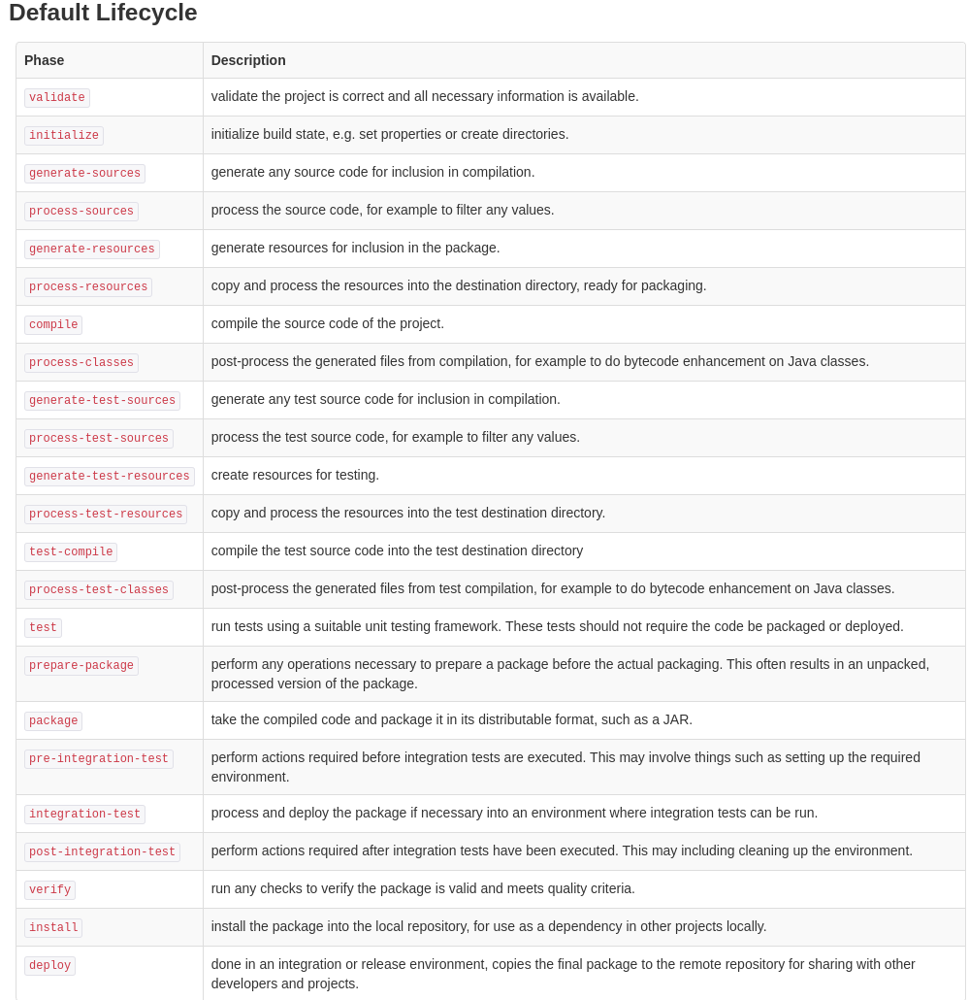

## Testing with Maven - Organizing unit and integration tests

<!-- TOC -->
  * [Testing with Maven - Organizing unit and integration tests](#testing-with-maven---organizing-unit-and-integration-tests)
    * [Introduction](#introduction)
    * [How does a Maven project look like?](#how-does-a-maven-project-look-like)
    * [What does Maven Surefire plugin do?](#what-does-maven-surefire-plugin-do)
    * [Why isn't Surefire plugin good for running integration tests?](#why-isnt-surefire-plugin-good-for-running-integration-tests)
    * [Maven Failsafe Plugin](#maven-failsafe-plugin)
    * [How does Maven Failsafe plugin work?](#how-does-maven-failsafe-plugin-work)
    * [How to organize tests properly in your Maven project?](#how-to-organize-tests-properly-in-your-maven-project)
      * [Mix unit and integration tests](#mix-unit-and-integration-tests)
        * [Advantages](#advantages)
        * [Disadvantages](#disadvantages)
      * [Separate unit and integration tests on package level](#separate-unit-and-integration-tests-on-package-level)
        * [Advantages](#advantages-1)
        * [Disadvantages](#disadvantages-1)
      * [Separate unit and integration tests or root folder level](#separate-unit-and-integration-tests-or-root-folder-level)
        * [How to set it up?](#how-to-set-it-up)
          * [Maven Compiler Plugin Way](#maven-compiler-plugin-way)
          * [build-helper-maven-plugin way](#build-helper-maven-plugin-way)
        * [Advantages](#advantages-2)
        * [Disadvantages](#disadvantages-2)
      * [Surprise option: New maven module](#surprise-option-new-maven-module)
        * [Advantages](#advantages-3)
        * [Disadvantages](#disadvantages-3)
    * [Summary](#summary)
* [Follow Rodnan Sol for more](#follow-rodnan-sol-for-more)
* [Follow the author too](#follow-the-author-too)
<!-- TOC -->

### Introduction

Are you making unit and integration tests in your project? I hope so! 

Tests are the fundamentals of a good working and quality software, nobody shouls be skipping them, even if their clients says it :fire:.

If you are a Java developer you probably know the different build tools out there and their support for writing and running unit and integration tests:

- Ant
- Maven
- Gradle
- **You name it**

In this post we will be focusing on **Maven**, built and maintained by ASF (Apache Software Foundation). 

Maven is a beautiful project that helped millions of projects go live, it is an industry standard, but nothing is perfect even millions of projects are depending on it. In this post we are not going to find all the negativity behind the Maven build tool, only just to focus on the testing topics, and to give you advices how your projects structure could be setup to enforce a better test and production code quality.

If you are familiar with a setup of a Maven project, and you know how the different plugins like the Surefire and Failsafe handle the compiled test classes, then you can skip to the following [section](#how-to-organize-tests-properly-in-your-maven-project), the very first few ones are just introducing how Maven is handling the tests. If you want to refresh your knowledge do read the first chapters too! :)


### How does a Maven project look like?

By default, if a new projects is just initialized, it should look like this:


The `UserService` classes are just here for the example, there is no framework behind them, there is no real logic, only for the sake of demonstration.

How can we execute the tests that are in our project? That is easy, just run the `mvn test` command in your terminal.

```shell
$ mvn test
[INFO] Scanning for projects...
[INFO]
[INFO] ------------------< org.rodnansol:simple-test-setup >-------------------
[INFO] Building simple-test-setup 1.0-SNAPSHOT
[INFO]   from pom.xml
[INFO] --------------------------------[ jar ]---------------------------------
[INFO]
[INFO] --- resources:3.3.0:resources (default-resources) @ simple-test-setup ---
[WARNING] Using platform encoding (UTF-8 actually) to copy filtered resources, i.e. build is platform dependent!
[INFO] Copying 0 resource
[INFO]
[INFO] --- compiler:3.10.1:compile (default-compile) @ simple-test-setup ---
[INFO] Nothing to compile - all classes are up to date
[INFO]
[INFO] --- resources:3.3.0:testResources (default-testResources) @ simple-test-setup ---
[WARNING] Using platform encoding (UTF-8 actually) to copy filtered resources, i.e. build is platform dependent!
[INFO]
[INFO] --- compiler:3.10.1:testCompile (default-testCompile) @ simple-test-setup ---
[INFO] Nothing to compile - all classes are up to date
[INFO]
[INFO] --- surefire:3.0.0-M8:test (default-test) @ simple-test-setup ---
[INFO] Using auto detected provider org.apache.maven.surefire.junitplatform.JUnitPlatformProvider
[INFO]
[INFO] -------------------------------------------------------
[INFO]  T E S T S
[INFO] -------------------------------------------------------
[INFO] Running org.rodnansol.user.UserServiceTest
OpenJDK 64-Bit Server VM warning: Sharing is only supported for boot loader classes because bootstrap classpath has been appended
[INFO] Tests run: 1, Failures: 0, Errors: 0, Skipped: 0, Time elapsed: 0.645 s - in org.rodnansol.user.UserServiceTest
[INFO]
[INFO] Results:
[INFO]
[INFO] Tests run: 1, Failures: 0, Errors: 0, Skipped: 0
[INFO]
[INFO] ------------------------------------------------------------------------
[INFO] BUILD SUCCESS
[INFO] ------------------------------------------------------------------------
[INFO] Total time:  1.629 s
[INFO] Finished at: 2023-06-04T17:45:29+02:00
[INFO] ------------------------------------------------------------------------
```

What happened in this case?

Maven has multiple **phases** that can be executed, as Maven has the `pom.xml` file, it also has a so called **Effective POM** that contains all the phase configurations, but they are not presented in the `pom.xml` file because that would be too verbose, and it would be difficult to read. These configurations are inherited from the so-called **Super POM**.

The **Effective POM** contains all the plugins that will be run when a specific phase is executed, the phases are backed by plugins, like the **maven-clean-plugin**, **maven-compiler-plugin** and the **maven-surefire-plugin** for example that is executing any tests.

Do not here is that the **maven-surefire-plugin** executes its `test` goal in the `test` phase. Even if they are having the same wording it is not the same. The other thing is also crucial, we do not see the `maven-failsafe-plugin` here, which will be a key later.

Okay, okay, I want to see it with my eyes, so how to create the effective-pom? It is easy: `mvn help:effective-pom`.

As it is being more than 250 lines, let me just copy a small section of it.

We can see the configuration of the **maven-clean-plugin** and the **maven-surefire-plugin**:


### What does Maven Surefire plugin do?

TL;DR: It executes tests.

Seriously, it is executing tests, but how does it recognize tests?

The plugin has configuration values, and one of them first defines the folder of the compiled test classes and the other configuration options sets the included files, it is done mostly by patterns.

- Test class directory: https://maven.apache.org/surefire/maven-surefire-plugin/test-mojo.html#testclassesdirectory
  - By default: `target/test-classes` - and it is compiled by the **maven-compiler-plugin**'s **testCompile** goal at the **test-compile** phase. A lots of things are going there for sure. :fire:
- Included classes: https://maven.apache.org/surefire/maven-surefire-plugin/test-mojo.html#includes 
  - By default any Java file that ends with: Test*.java *Test.java, *Tests.java, *TestCase.java.


Now may come the **AHA!** moment, "so this is why my shiny JUnit test was not executed, because I named it UserServiceT or UserServiceTE".

Yes! But you can configure it to include new patterns or specific files can be put into the include section.

### Why isn't Surefire plugin good for running integration tests?

If we check the default lifecycle, we will see a list of the available phases: 

https://maven.apache.org/guides/introduction/introduction-to-the-lifecycle.html#default-lifecycle



Let's check the `test` phase again. Before this phase we can only see the `test-compile` which is necessary to compile the test classes, we definitely see some other phases, but they are not that "interesting" for us now.

After that we see no "test" related phases, but the `integration-test` phase, which is not associated with the Surefire plugin by default.

What if we want to run integration tests, that would require different environmental setups, like running a **docker-compose.yml** file before running any integration test, and stopping the started dependencies when the integration tests finished?

**Maven Surefire is not created for running integration tests, this is why it is not picking up test classes having the IT,ITCase postfix in their names, for that Maven Failsafe plugin should be used!**

:memo: One small note here: You definitely can configure the Surefire plugin to handle the test classes ending with IT,ITCase, but it is just not meant to be used with them. On the other hand, integration tests also can be named as simple Test,Tests,TestCase, but they are different, please do not mix your unit and integration tests.

### Maven Failsafe Plugin

Let me quote the following from the Failsafe plugin's documentation:

"The Failsafe Plugin is designed to run integration tests while the Surefire Plugin is designed to run unit tests. The name (failsafe) was chosen both because it is a synonym of surefire and because it implies that when it fails, it does so in a safe way.

The Maven lifecycle has four phases for running integration tests:

- **pre-integration-test** for setting up the integration test environment.
- **integration-test** for running the integration tests.
- **post-integration-test** for tearing down the integration test environment.
- **verify** for checking the results of the integration tests.

If you use the Surefire Plugin for running tests, then when you have a test failure, the build will stop at the integration-test phase and your integration test environment will not have been torn down correctly.

The Failsafe Plugin is used during the integration-test and verify phases of the build lifecycle to execute the integration tests of an application. The Failsafe Plugin will not fail the build during the integration-test phase, thus enabling the post-integration-test phase to execute." - Source: https://maven.apache.org/surefire/maven-failsafe-plugin/

It can not be described better:

- For unit test: Use **Surefire** !
- For integration tests: Use **Failsafe** ! 

### How does Maven Failsafe plugin work?

It is "almost" doing the same as the **Surefire** plugin, it executes test from a specific directory and with a specific filename pattern.

- Test classes directory: https://maven.apache.org/surefire/maven-failsafe-plugin/integration-test-mojo.html#testclassesdirectory 
  - Same as for the **Surefire**, so the `target/test-classes`, the compiled source files are also being compiled by the **Maven Compiler Plugin**
- Included classes: https://maven.apache.org/surefire/maven-failsafe-plugin/integration-test-mojo.html#includes 
  - This is where the difference can be seen easily, while the **Surefire** plugin included java classes ending with Test,Tests,TestCase postfixes, in this case the following patterns are the default: IT*.java, *IT.java, *ITCase.java. - So for example `UserServiceIT.java` or `CreateUserITCase.java`.

The main point here is that by default unit and integration tests must be put into the "same" folder structure, so to the `src/tests` folder. There are no `src/it` or `src/it-test` options by default, but it can changed easily, wait till the end.

---

### How to organize tests properly in your Maven project?

We have a few options, I will show you 3 that I'm aware of, and I will try to define the advantages and the disadvantages of the different setups.

I want to make a note here, our goal is to **not break the package setups**, so every time we write a unit or integration tests for a class, we would like to mirror the setup of the production and test code packages like this:


So if we have a package like this: `org.rodnansol.user` and we have a class in it named `UserService` our `UserServiceTest` or `UserServiceIT` should end up in the `org.rodnansol.user` package too.

There are cases when our integrations tests (because we name them IT) are covering a different level in the level test pyramid, like full end 2 end tests, in those cases it is another topic how the classes are structured, but if you think about it, in those cases, you might not know about the code you are testing, in those cases it can be a blackbox, and it is up to you how you set it up.

Quick spoiler: In the second option we will break it, but you will see.

**Do not forget to set up the Maven Failsafe plugin to run the tests!**

```xml
<plugin>
    <artifactId>maven-failsafe-plugin</artifactId>
    <version>3.0.0-M8</version>
    <executions>
        <execution>
            <id>default-integration-test</id>
            <phase>integration-test</phase>
            <goals>
                <goal>integration-test</goal>
            </goals>
        </execution>
    </executions>
</plugin>
```

#### Mix unit and integration tests

As its name say, mix the unit and integration tests, just by placing them next to each other.


##### Advantages

- Tests can be found easily next to each other.
- Encapsulation should not be broken, so if the `UseService` will only be used in the `user` package, it can be **package private**. Just because we are writing a test for a class, it does not mean that the encapsulation should be broken, it is also true for methods, fields, constants in classes. Always work for the narrowest scope, do not extend it just because a test needs something.
  - Yes, if you did not know, visibility in the production and test code are not different, so tests can access package private or protected members of the production code! Use it wisely!

##### Disadvantages
- The unit and integration tests are mixed, it can pollute the code and if the integration test is having different utility classes they may end up next to these classes, and with time and without proper maintenance the setup can be a mess.

---

#### Separate unit and integration tests on package level

I have seen it on many projects where if we had a package structure like this: `org.rodnansol.user` developers introduced a middle package that meant to be used by the integration tests for example: `org.rodnansol.it.user` or `org.rodnansol.integrationtest.user`.


##### Advantages

- Unit and integration tests are separated.
- Integration test related utilities can be put next to the integration test and they can be marked as package private, to make sure other tests will not use it.

##### Disadvantages

- Encapsulation is broken! Not just a little, but way too much!
  - Our UserService class from now can not be package-private.
  - None of the UserService methods can be package-private that will be used in the integration-test.
  - If we want to play around with some dependency mocking if they reside in the same package as package-private classes, now they must be public to be accessible for the test.

Even if it seems tempting to use this kind of setup, please think about the consequences in the production code. Visibility modifiers are created to be used wisely and properly. Just because a test needs to test a method, it can not be a reason to change its visibility modifier! I would call it as a code smell!

**Please think twice before this options is going to be used.**

---

#### Separate unit and integration tests or root folder level

From my point of view probably the "cleanest" solution! Separating the unit and integration tests on "root" folder level, like on the picture below.


The main problem with this setup is that it does not work without some configuration. The **Maven Compiler Plugin** compiles the Java classes in the following directories:

- `src/main/java`
- `src/test/java`

So if we want to introduce a third folder we should be making changes even to the **Maven Compiler Plugin,** or we have to trick the system, and we have to make sure even if the **Maven Compiler Plugin**'s default configuration is not overwritten our Java classes and resource files are compiled and can be used by the **Maven Failsafe Plugin**.

##### How to set it up?

First of all create the following folder stucture for your project:

- `<project-root-level>`
  - src
    - it
      - java
      - resources
    - main
      - java
      - resources
    - test
      - java
      - resources

###### Maven Compiler Plugin Way

Overwrite the default configuration of the **maven-compiler-plugin** and for the `test-compile` phase overwrite the `compileSourceRoots` configuration values and add the following entries to it:

- `<compileSourceRoot>src/test/java</compileSourceRoot>`
- `<compileSourceRoot>src/it/java</compileSourceRoot>`

To make sure any test related resources, that is not a Java file, is copied to the `target/test-classes` folder, we must configure the `<testResources>` tag too, to include the resources from the `src/it/resources` folder too. It is done by the **Maven Resources Plugin**.

Check out the full plugin configuration:

```xml
<build>
    <testResources>
        <testResource>
            <directory>src/it/resources</directory>
        </testResource>
        <testResource>
            <directory>src/test/resources</directory>
        </testResource>
    </testResources>
    <plugins>
        <plugin>
            <artifactId>maven-compiler-plugin</artifactId>
            <version>3.11.0</version>
            <executions>
                <execution>
                    <id>default-testCompile</id>
                    <phase>test-compile</phase>
                    <goals>
                        <goal>testCompile</goal>
                    </goals>
                    <configuration>
                        <compileSourceRoots>
                            <compileSourceRoot>src/test/java</compileSourceRoot>
                            <compileSourceRoot>src/it/java</compileSourceRoot>
                        </compileSourceRoots>
                    </configuration>
                </execution>
            </executions>
        </plugin>
        <plugin>
            <artifactId>maven-failsafe-plugin</artifactId>
            <version>3.0.0-M8</version>
            <executions>
                <execution>
                    <id>default-integration-test</id>
                    <phase>integration-test</phase>
                    <goals>
                        <goal>integration-test</goal>
                    </goals>
                </execution>
            </executions>
        </plugin>
    </plugins>
</build>
```

###### build-helper-maven-plugin way

In this case the **maven-compiler-plugin** should not be overwritten, but a new plugin must be introduced to the whole project, it is called **build-helper-maven-plugin**.

The folder setup is the same as before, but in this case with the plugin we hook two goals to the following phases:

- generate-test-sources - "generate any test source code for inclusion in compilation." - With this phase binding our classes from the `src/it/java` will be compiled during the test-compile phase.
- generate-test-resources - "create resources for testing." - With this phase binding all the integration test related resources files are going to be copied to the `target/test-classes` folder.
  - With the `<filtering>` option if any of the resource files are containing variable substitutions (${}) maven will filter those values and replace them with values from the `pom.xml` - this is optional.

Check out the full plugin configuration:
```xml
<build>
    <plugins>
        <plugin>
            <groupId>org.codehaus.mojo</groupId>
            <artifactId>build-helper-maven-plugin</artifactId>
            <version>3.4.0</version>
            <executions>
                <execution>
                    <id>add-integration-test-sources</id>
                    <phase>generate-test-sources</phase>
                    <goals>
                        <goal>add-test-source</goal>
                    </goals>
                    <configuration>
                        <sources>
                            <source>src/it/java</source>
                        </sources>
                    </configuration>
                </execution>
                <execution>
                    <id>add-integration-test-resources</id>
                    <phase>generate-test-resources</phase>
                    <goals>
                        <goal>add-test-resource</goal>
                    </goals>
                    <configuration>
                        <resources>
                            <resource>
                                <filtering>true</filtering>
                                <directory>src/it/resources</directory>
                            </resource>
                        </resources>
                    </configuration>
                </execution>
            </executions>
        </plugin>
        <plugin>
            <artifactId>maven-failsafe-plugin</artifactId>
            <version>3.0.0-M8</version>
            <executions>
                <execution>
                    <id>default-integration-test</id>
                    <phase>integration-test</phase>
                    <goals>
                        <goal>integration-test</goal>
                    </goals>
                </execution>
            </executions>
        </plugin>
    </plugins>
</build>
```

After any of the plugin setups the following command should copy and compile any test sources and resources into the `target/test-classes` folder: `mvn clean verify`.

The `verify` phase will trigger the **Maven Failsafe Plugin**'s `integration-test` goal within the `integration-test` phase.

:memo: **Small note:**

Make sure the files under the `src/test` and `src/it` are having different names because they will overwrite each other, and it will cause surprises.

##### Advantages

- Unit and integration tests are separated.
- Integration test related utilities can be put next to the integration test and they can be marked as package private, to make sure other tests will not use it.
- Encapsulation will not be broken, if the packaging is correct, both the unit and integration tests will be able to access the allowed classes.

##### Disadvantages

- The **Maven Compiler Plugin** must be changed OR a 3rd party Maven plugin, named **build-helper-maven-plugin** must be introduced to help with the necessary setups.

---

#### Surprise option: New maven module

I will not go into details, but I have already seen a few projects where integration tests were not part of the actual Maven module, but they were in a new module which only contained integration tests.

##### Advantages

- Unit and integration tests are separated.
- Integration test related utilities can be put next to the integration test and they can be marked as package private, to make sure other tests will not use it.

##### Disadvantages

- The new maven module must depend on the one it is verifying with the integration tests, so the maven module under test can be built without even verifying its behaviour. You decide if it is an advantage or disadvantage. The whole purpose of doing tests is to make sure an artifact is not being packaged if there are problems with its behaviour.

---

### Summary

Wow! That was a long journey, I hope you found it useful and this setup will be utilized in your next project setup :tada: 

- We learnt how Maven works and how it generates and uses its **Effective POM** to build up its lifecycles.
- We learnt how **Surefire** and **Failsafe** plugins work and how they differ.
- We learnt 3 ways to set up our unit and integration tests in detail.
- We learnt a 4th method briefly.

I'm curious what you think about it, if you have made it so far! 

How are you setting up your projects?

- Do you see similarities?
- What are the problems you are facing with your current setup?
- Will you consider separating your unit and integration tests?

Check out the project here:



---

# Follow Rodnan Sol for more

<p align="center">
<a href="https://twitter.com/rodnansol"></a>
<a href="https://github.com/rodnansol"></a>
<a href="https://dcbadge.vercel.app/api/server/USyh6XUjvP"></a>
</p>


# Follow the author too

<p align="center"> 
<a href="https://twitter.com/therealhnk"></a>
<a href="https://github.com/nandorholozsnyak"></a>
</p>